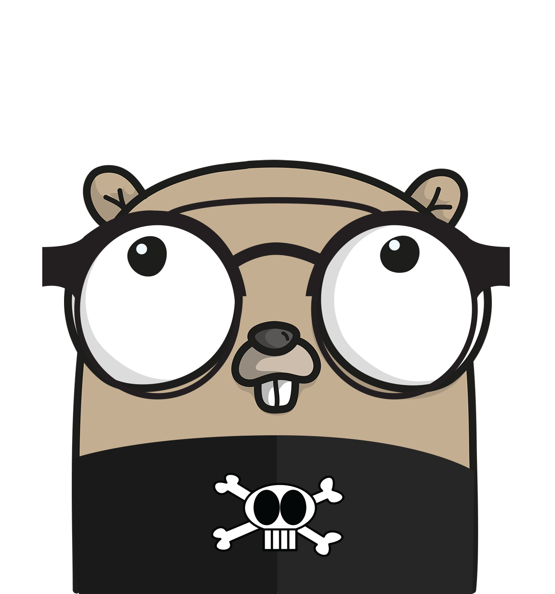

# Hello Go!
## @AidHamza

---

## $ whoami



* @AidHamza
* Software engineer @Schibsted Media Group

---

## Golang

https://github.com/golang/go

* Open source programming language
* Compiled, statically typed language
* Built-in concurrency primitives

+++?image=assets/gophers.jpg

---

## Syntaxes

+++

### variable declaration

``` go
var a int
var b = 1
var c, d int = 2, 3

func F() {
    l := 10
}
```

@[1](a is not set the value, initialized by zero)
@[2](b is declared with init value 1)
@[3](you can declare some variable at the same time)
@[6](short variable declaration)

+++

### iota

* use within a constant declaration
* represents successive untyped integer constants
  - reset to 0 when `const` appears
  - increments after each ConstSpec

+++

#### e.g.) iota: every

``` go
const (
    a = iota // a == 0
    b = iota // b == 1
    c = iota // c == 2
    d = iota // d == 3
)
```

+++

#### e.g.) iota: can ommit

```go
const (
    a = iota // a == 0
    b        // b == 1
    c        // c == 2
    d        // d == 3
)
```

+++

#### e.g.) iota: w/bit shift

``` go
const (
    a = 1 << iota // a == 1
    b             // b == 2
    c             // c == 4
    d             // d == 8
```

+++

### Initializer Statement

``` go
if err := Foo(); err != nil {
    // error handling
}
```

@[1](exec `Foo` and bind returned value to `err`)
@[1](check the condition)
@[2](do if the condition is true)

+++

### defer Statement

``` go
func Bar() {
    f, _ := os.Open("gopher.txt") // _ is blank ident.
    defer f.Close()

    // Something

    return
}
```

@[2](open resource)
@[5](something may include panic)
@[7](function ends)
@[3](resource is released)

+++

### Composite literal

initializer literal for array, map, and structs

``` go
a := []int{1, 2, 3}
m := map[string]int{"Jack": 24, "James": 30}

type Person struct {
    ID   string
    Name string
}
p := Person{ID: "foo", Name: "bar"}
p := Person{"hoge", "fuga"}

type Fruit struct {
    Name  string
    Value int
}{"Apple", "120"}
```

@[1](array)
@[2](string to int map)
@[8](Person struct)
@[9](can ommit field name)
@[11-14](can connect type declaration and composite literal)

---

## GOPATH

* Go load packages from $GOPATH
  - third party libs
  - my(your) projects
* $GOPATH/src/DOMAIN/USERNAME/REPO
  - e.g.) $GOPATH/src/github.com/AidHamza/go-meetup

+++

### `go get`

download and install packages and dependencies

* you can install packages like pip, gem, cpan(m)...
* you can install binary created from Go

---

## Go Routines & Channel

A goroutine is a lightweight thread managed by the Go runtime.


+++

Channels are the pipes that connect concurrent goroutines. You can send values into channels from one goroutine and receive those values into another goroutine.

+++

### `go get`

download and install packages and dependencies

* you can install packages like pip, gem, cpan(m)...
* you can install binary created from Go

---

## testing package

* provides support for automated testing for Go packages
* run `$ go test`
  - automate exec any functions of the form:
    + `func TestXxx(*testing.T)`
* run `$go test -bench`
  - automates exec of benchmark functions of the form:
    + `func BenchmarkXxx(*testing.B)`

+++

### `testing.T`

* test state and formatted test log manager
* some useful functions
* you can write tests **regular** go way.

+++

#### e.g.) you can write tests regular go way

``` go
func Unit(in float64) int {
    if in <= 0 {
        return 0
    }
    return 1
}

func TestUnit(t *testing.T) {
    in := 2.0
    expected := 1
    if out:= Unit(in); out != expected {
        t.Errorf("error: %d != %d", out, expected)
        return
    }
}
```

@[1-6](Unit function returns 1 if input is over 0, otherwise return 1)
@[9-10](define test values)
@[11-14](LOOK: using `if` statement, not `assume` or `equal` or so on)
@[12](if returned unexpected value, use `t.Errorf` like `fmt.Errorf`)

+++

#### e.g.) Table Driven Tests

``` go
func TestUnit(t *testing.T) {
    candidates := []struct{
        in float64
        expected int
    }{
        {in: -0.1, expected: 0},
        {in: 0, expected: 0},
        {in: 0.1, expected: 1},
    }
    for _, c := range candidates {
        t.Logf("input: %f", c.in)
        if out := Unit(c.in); out != c.expected {
            t.Errorf("error: %d != %d", out, c.expected)
            return
        }
    }
}
```

@[2-9](define test values)
@[10-16](test the values)
@[6-8](if you want to add some test patterns, you can add easily)

---

## package document

+++

### Documentation Comment

Comments before top-level delarations are extracted as explanatory text
like:

``` go
// Compile parses a regular expression and returns, if successful,
// a Regexp that can be used to match against text.
func Compile(str string) (*Regexp, error) {
    ...
}
```

---

## tools for Go

+++

### gofmt

* source code formatter for Go
  - `gofmt -w hoge.go`

+++

### `go vet`

* examine Go source code and reports suspicious constructs
  - uses heuristics
  - find errors not caught by the compilers

#### e.g.) unreachable code

``` go
func main() {
    fmt.Print("hello, ...")
    return
    fmt.Print("this print is unreachable")
}
```

@[0](main.go:7: unreachable code)

+++

### `godoc`

`$ go get golang.org/x/tools/cmd/godoc`

#### without -http flag

* command-line golang package reference
  - `godoc fmt`
    + documentation for package `fmt`

#### with -http flag

* runs as a web server and presents the docs as a web page
  - like https://golang.org
  - but not same. local packages are printed!!

+++

### present

`$ go get golang.org/x/tools/cmd/present`

* slide presentation
  - like: https://talks.golang.org/2017/state-of-go.slide#1
* can run go code in slides

---

## The Go PlayGround

https://play.golang.org/

* you can run go code on browser
* you can share go code

---

# Q?
